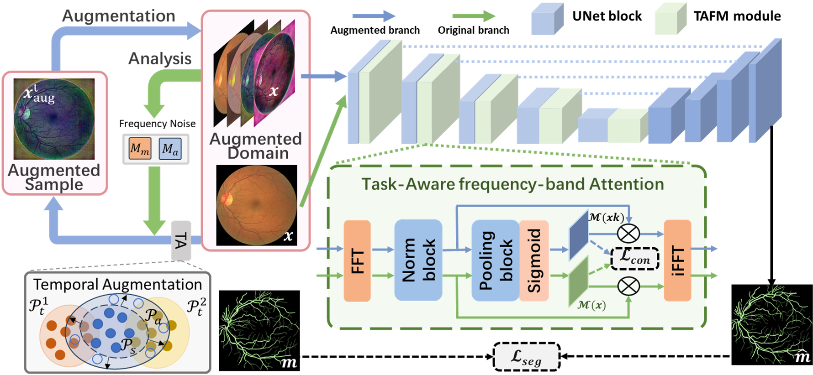

[README.md](https://github.com/user-attachments/files/24211885/README.md)
# CLFA-SDG: Closed-Loop Frequency Augmentation for Single-Source Domain Generalization in Medical Image Segmentation

Official PyTorch implementation of the paper: CLFA-SDG: Closed-Loop Frequency Augmentation for Single-Source Domain Generalization in Medical Image Segmentation. 
Submitted to Neurocomputing (2025)

---

## News

- [2025-12-17] Initial release.

---

## Overview

Single-source domain generalization (SDG) for medical image segmentation remains challenging under unseen domain shifts (scanner, protocol, site, modality, noise, contrast, etc.).  
This work proposes a **closed-loop frequency augmentation** framework that:

1. Performs **spectral analysis** between the original data distribution and its augmented samples.
2. Identifies **under-augmented frequency bands** (spectral discrepancy / uncovered regions).
3. Applies **frequency-complementary perturbations** to enrich augmentation coverage.
4. Uses **task-adaptive frequency modulation** to preserve clinically relevant structures and boundary fidelity.

**Core keywords:** Single-source domain generalization; Medical image segmentation; Spectral analysis; Frequency-domain augmentation; Closed-loop augmentation; Domain shift robustness.

---

## Method

### Key components

- **IFCA (Iterative Frequency-Complementary Augmentation)**  
  Iteratively detects under-covered frequency bands and injects complementary perturbations into those bands.

- **TAFM (Task-Adaptive Frequency Modulation)**  
  Modulates the strength/region of frequency perturbations according to segmentation objectives (e.g., boundary fidelity).

### Pipeline figure



---

## Repository Structure

```text
.
├── procedures/                  # training/testing entry points 
├── datasets/                    # dataset loaders 
├── models/                      # networks and method modules (core code)
├── losses/                      # loss functions 
├── utils/                       # metrics, logging, helpers 
├── images/                      # README figures
├── requirements.txt
└── README.md
```

## Datasets

We use **mostly public datasets** and a **small private subset**.  
Detailed dataset descriptions and citations are provided in the manuscript.

### Task 1: Fundus vessel segmentation (CFP)

- **Source (train):** [DRIVE](https://drive.grand-challenge.org/)
- **Targets (test):**
  - [AVRDB](https://data.mendeley.com/datasets/3csr652p9y/1)
  - [CHASEDB1](https://blogs.kingston.ac.uk/retinal/chasedb1/)
  - IOSTAR
  - [STARE](http://cecas.clemson.edu/~ahoover/stare/)

### Task 2: OCT retinal layer segmentation

- **Source (train):** HC-MS 
- **Targets (test):**
  - DUKE
  - AROI
  - GOALS

### Task 3: Ultrasound cartilage segmentation (private)

- **Source (train):** [Private Dataset A]
- **Targets (test):** [Private Dataset B/C/D]

Private data statement:  
Due to privacy/copyright restrictions, the private subset cannot be shared publicly.

All of the above datasets should be organized in the following structure:

```
<root_name>
- 0
    - image.png
    - label.png
    - mask.png
- 1
- 2
...
```

## Dependencies

* torch>=0.4.1
* torchvision>=0.2.1
* dominate>=2.3.1
* visdom>=0.1.8.3

## Training

Before running the training code, you need to start the visdom server by running the following command:

```
python -m visdom.server -p <some free port> --host 0.0.0.0
```

The training command is as follows:

```
python /data4/huyan/liheng/cjy/code/baseline_integration/procedures/train.py --model_name genap_mask --input_nc 3 --output_nc 1 --dataset_name naive --batch_size 2 --preprocess vertical_flip horizontal_flip rotate --drop_last --optimizer adam --lr_scheduler linear --epochs_num 100 --decay_epochs_num 50 --sample_repeat 10 --save_epoch_freq 2 --optimizer_lr 0.02 --name genap_drive_patch_16_16_25 --display_port 19191 --gpu_ids 0 --data_dirname /data4/huyan/liheng/cjy/data/retinal_vessel/drive/crop_train --lambda_consist 0.1 --do_mild_aug --use_freq_aug --num_radial_bands 10 --num_gap_bands 25 --freq_region_mode patch --freq_patch_rows 16 --freq_patch_cols 16
```

The test command is as follows:

```
python /data4/huyan/liheng/cjy/code/baseline_integration/procedures/test.py --model_name genap_mask --input_nc 3 --output_nc 1 --dataset_name naive --batch_size 1 --preprocess --metrics_list dice iou --name genap_drive_patch_16_16_25 --data_dirname folder_to_dataA folder_to_dataB folder_to_dataC folder_to_dataD --gpu_ids 7 --load_epoch last --secondary_dirname time_for_training_checkpoint(eg. 2025_11_26_15_46_45)
```

## Acknowledgment

This work was supported in part by the National Key R\&D Program of China (No. 2024YFC2510800), National Natural Science Foundationof China (62401246),  and Shenzhen Science and Technology Program (JCYJ20250604185805008, JCYJ20240813095112017)
